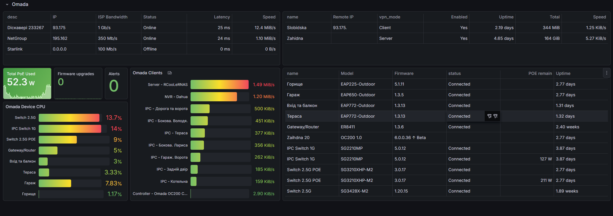
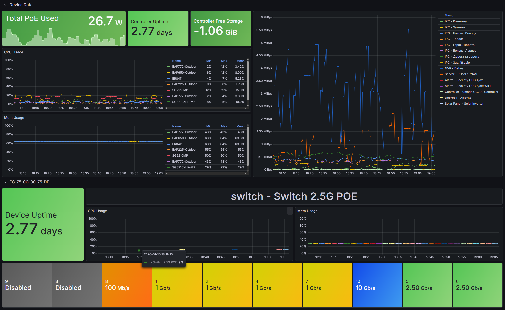
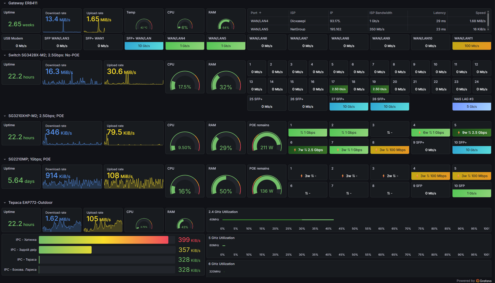

# omada_exporter


<p align="center" style="text-align: center">
    
</p>

# Prometheus Exporter for TP-Link Omada Controller SDN.

>“RCooLeR/omada_exporter is a maintained fork of charlie-haley/omada_exporter with additional metrics and Open API support.”

### 📈 Dashboard

There are [default dashboards in this repo](docs/dashboards/), which is a good starting point for visualizing your metrics.

You can also find it on [Grafana.com](https://grafana.com/grafana/dashboards/16343).

<p align="center" style="text-align: center">
    <br/>
</p>
<p align="center" style="text-align: center">
    <br/>
</p>

<p align="center" style="text-align: center">
    <br/>
</p>

## Installation

### Omada Authentication Setup

- OpenAPI Client – Created via: `Settings -> Platform Integration`.
  Assign admin role for full API access.
- Service User – Create under: `Account section` at `Global level`.
  Assign viewer role for read-only access.

### 🚀 Docker Run Example

```bash
docker run -d \
    -p 9202:9202 \
    -e OMADA_HOST='https://192.168.1.20' \
    -e OMADA_USER='exporter' \
    -e OMADA_PASS='mypassword' \
    -e OMADA_SITE='Default' \
    -e OMADA_CLIENT_ID='' \
    -e OMADA_SECRET_ID='' \
    chhaley/omada_exporter
```

### 📦 Docker Compose Example

```yaml
services:
  omada_exporter:
    image: rcooler/omada_exporter:latest
    container_name: omada_exporter
    ports:
      - "9202:9202"
    environment:
      OMADA_HOST: "https://192.168.1.20:443"
      OMADA_USER: "exporter"
      OMADA_PASS: "mypassword"
      OMADA_SITE: "Default"
      OMADA_CLIENT_ID: ""
      OMADA_SECRET_ID: ""
    restart: unless-stopped
```

### 🖥️ Command Line

[You can download the latest binary release here.](https://github.com/RCooLeR/omada_exporter/releases/latest)

```
NAME:
   omada-exporter - Prometheus Exporter for TP-Link Omada Controller SDN.

USAGE:
   main [global options] command [command options] [arguments...]

VERSION:
   development

AUTHOR:
   Charlie Haley <charlie-haley@users.noreply.github.com>
   Roman Derevianko <RCooLeR@users.noreply.github.com>

COMMANDS:
   version, v  prints the current version.
   help, h     Shows a list of commands or help for one command

GLOBAL OPTIONS:
   --host value                 The hostname of the Omada Controller, including protocol. [$OMADA_HOST]
   --username value             Username of the Omada user you'd like to use to fetch metrics. [$OMADA_USER]
   --password value             Password for your Omada user. [$OMADA_PASS]
   --port value                 Port on which to expose the Prometheus metrics. (default: "9202") [$OMADA_PORT]
   --site value                 Omada site to scrape metrics from. (default: "Default") [$OMADA_SITE]
   --client-id value            Optional Client ID for Open API authentication. [$OMADA_CLIENT_ID]
   --secret-id value            Optional Secret ID for Open API authentication. [$OMADA_SECRET_ID]
   --log-level value            Application log level. (default: "error") [$LOG_LEVEL]
   --timeout value              Timeout when making requests to the Omada Controller. (default: 15) [$OMADA_REQUEST_TIMEOUT]
   --insecure                   Whether to skip verifying the SSL certificate on the controller. (default: false) [$OMADA_INSECURE]
   --disable-go-collector       Disable Go collector metrics. (default: true) [$OMADA_DISABLE_GO_COLLECTOR]
   --disable-process-collector  Disable process collector metrics. (default: true) [$OMADA_DISABLE_PROCESS_COLLECTOR]
   --help, -h                   show help (default: false)
   --version, -v                print the version (default: false)
```

## ⚙️ Configuration


### 📡 Prometheus Scrape Job Example

Add the following job to your `prometheus.yml` configuration:

```yaml
  - job_name: 'Omada'
    scrape_interval: 30s
    scrape_timeout: 30s
    static_configs:
      - targets: ['omada_exporter:9202']
```

> Make sure `omada_exporter` resolves to your container or host running `omada_exporter`.

### Environment Variables

| Variable                        | Purpose                                                                           |
|---------------------------------|-----------------------------------------------------------------------------------|
| OMADA_HOST                      | The hostname of the Omada Controller, including protocol.                         |
| OMADA_USER                      | Username of the Omada user you'd like to use to fetch metrics.                    |
| OMADA_PASS                      | Password for your Omada user.                                                     |
| OMADA_SITE                      | Site you'd like to get metrics from. (default: "Default")                         |
| OMADA_PORT                      | Port on which to expose the Prometheus metrics. (default: 9202)                   |
| OMADA_INSECURE                  | Whether to skip verifying the SSL certificate on the controller. (default: false) |
| OMADA_REQUEST_TIMEOUT           | Timeout when making requests to the Omada Controller. (default: 15)               |
| OMADA_DISABLE_GO_COLLECTOR      | Disable Go collector metrics. (default: true)                                     |
| OMADA_DISABLE_PROCESS_COLLECTOR | Disable process collector metrics. (default: true)                                |
| LOG_LEVEL                       | Application log level. (default: "error")                                         |
| OMADA_CLIENT_ID                 | Optional Client ID for Open API authentication (WAN & VPN metrics)                |
| OMADA_SECRET_ID                 | Optional Secret ID for Open API authentication (WAN & VPN metrics)                |

### PS

Last tested on [OC200](https://www.omadanetworks.com/us/business-networking/omada-controller-hardware/oc200/), firmware 6.0.0.36 (ER8411,SG3428X-M2,SG3210XHP-M2,SG2210MP,EAP772-Outdoor,EAP650-Outdoor,EAP225-Outdoor,EAP235-Wall)

OpenApi docs: [https://use1-omada-northbound.tplinkcloud.com/doc.html](https://use1-omada-northbound.tplinkcloud.com/doc.html)
WebApi: no docs. Login to your controller and use Chrome debug tools  🤦

## 📊 Metrics

| Name | Description | Type | Labels |
|:-----|:------------|:-----|:-------|
| omada_client_connected_total | Total number of connected clients. | count | connection_mode site site_id wifi_mode |
| omada_client_download_activity_bytes | The current download activity for the client in bytes. | byte | ap_mac ap_name connect_dev_type connect_type device_category device_type gateway_mac gateway_name host_name ip lag_id mac name port ssid switch_mac switch_name system_name vendor vlan_id wifi_mode wireless |
| omada_client_rssi_dbm | The RSSI for the wireless client in dBm. | dbm | ap_mac ap_name connect_dev_type connect_type device_category device_type gateway_mac gateway_name host_name ip lag_id mac name port ssid switch_mac switch_name system_name vendor vlan_id wifi_mode wireless |
| omada_client_rx_rate | RX rate of wireless client. | bps | ap_mac ap_name connect_dev_type connect_type device_category device_type gateway_mac gateway_name host_name ip lag_id mac name port ssid switch_mac switch_name system_name vendor vlan_id wifi_mode wireless |
| omada_client_signal_pct | The signal quality for the wireless client in percent. | percent | ap_mac ap_name connect_dev_type connect_type device_category device_type gateway_mac gateway_name host_name ip lag_id mac name port ssid switch_mac switch_name system_name vendor vlan_id wifi_mode wireless |
| omada_client_snr_dbm | The signal to noise ratio for the wireless client in dBm. | dbm | ap_mac ap_name connect_dev_type connect_type device_category device_type gateway_mac gateway_name host_name ip lag_id mac name port ssid switch_mac switch_name system_name vendor vlan_id wifi_mode wireless |
| omada_client_traffic_down_bytes | Total bytes received by wireless client. | byte | ap_mac ap_name connect_dev_type connect_type device_category device_type gateway_mac gateway_name host_name ip lag_id mac name port ssid switch_mac switch_name system_name vendor vlan_id wifi_mode wireless |
| omada_client_traffic_up_bytes | Total bytes sent by wireless client. | byte | ap_mac ap_name connect_dev_type connect_type device_category device_type gateway_mac gateway_name host_name ip lag_id mac name port ssid switch_mac switch_name system_name vendor vlan_id wifi_mode wireless |
| omada_client_tx_rate | TX rate of wireless client. | bps | ap_mac ap_name connect_dev_type connect_type device_category device_type gateway_mac gateway_name host_name ip lag_id mac name port ssid switch_mac switch_name system_name vendor vlan_id wifi_mode wireless |
| omada_client_upload_activity_bytes | The current upload activity for the client in bytes. | byte | ap_mac ap_name connect_dev_type connect_type device_category device_type gateway_mac gateway_name host_name ip lag_id mac name port ssid switch_mac switch_name system_name vendor vlan_id wifi_mode wireless |
| omada_controller_storage_available_bytes | Total storage available for the controller. | byte | adopted_ap_and_switch_num adopted_ap_num adopted_olt_num adopted_osg_num adopted_osw_num ap_and_switch_capacity ap_capacity device_firmware_version device_ip device_mac device_model device_name device_uptime_seconds device_version device_version_upgrade olt_capacity osg_capacity osw_capacity share_ap_and_switch_capacity site site_id storage_name |
| omada_controller_storage_used_bytes | Storage used on the controller. | byte | adopted_ap_and_switch_num adopted_ap_num adopted_olt_num adopted_osg_num adopted_osw_num ap_and_switch_capacity ap_capacity device_firmware_version device_ip device_mac device_model device_name device_uptime_seconds device_version device_version_upgrade olt_capacity osg_capacity osw_capacity share_ap_and_switch_capacity site site_id storage_name |
| omada_controller_upgrade_available | Firmware upgrade available for the controller per channet. | value | adopted_ap_and_switch_num adopted_ap_num adopted_olt_num adopted_osg_num adopted_osw_num ap_and_switch_capacity ap_capacity device_firmware_version device_ip device_mac device_model device_name device_uptime_seconds device_version device_version_upgrade latest_version olt_capacity osg_capacity osw_capacity share_ap_and_switch_capacity site site_id upgrade_channel |
| omada_controller_uptime_seconds | Uptime of the controller. | seconds | adopted_ap_and_switch_num adopted_ap_num adopted_olt_num adopted_osg_num adopted_osw_num ap_and_switch_capacity ap_capacity device_firmware_version device_ip device_mac device_model device_name device_uptime_seconds device_version device_version_upgrade olt_capacity osg_capacity osw_capacity share_ap_and_switch_capacity site site_id |
| omada_device_2g_rx_util | The tx rate of the device on 2.4Ghz. | percent | device_any_poe_enable device_firmware_version device_hw_version device_ip device_mac device_model device_name device_show_model device_status device_subtype device_type device_uptime_seconds device_version device_version_upgrade device_wireless_linked device_wlan_group device_wp2g_band_width device_wp2g_mode device_wp2g_tx_max_rate device_wp5g1_band_width device_wp5g1_mode device_wp5g1_tx_max_rate device_wp5g2_band_width device_wp5g2_mode device_wp5g2_tx_max_rate device_wp5g_band_width device_wp5g_mode device_wp5g_tx_max_rate device_wp6g_band_width device_wp6g_mode device_wp6g_tx_max_rate site site_id |
| omada_device_2g_tx_util | The tx rate of the device on 2.4Ghz. | percent | device_any_poe_enable device_firmware_version device_hw_version device_ip device_mac device_model device_name device_show_model device_status device_subtype device_type device_uptime_seconds device_version device_version_upgrade device_wireless_linked device_wlan_group device_wp2g_band_width device_wp2g_mode device_wp2g_tx_max_rate device_wp5g1_band_width device_wp5g1_mode device_wp5g1_tx_max_rate device_wp5g2_band_width device_wp5g2_mode device_wp5g2_tx_max_rate device_wp5g_band_width device_wp5g_mode device_wp5g_tx_max_rate device_wp6g_band_width device_wp6g_mode device_wp6g_tx_max_rate site site_id |
| omada_device_5g_rx_util | The tx rate of the device on 5Ghz. | percent | device_any_poe_enable device_firmware_version device_hw_version device_ip device_mac device_model device_name device_show_model device_status device_subtype device_type device_uptime_seconds device_version device_version_upgrade device_wireless_linked device_wlan_group device_wp2g_band_width device_wp2g_mode device_wp2g_tx_max_rate device_wp5g1_band_width device_wp5g1_mode device_wp5g1_tx_max_rate device_wp5g2_band_width device_wp5g2_mode device_wp5g2_tx_max_rate device_wp5g_band_width device_wp5g_mode device_wp5g_tx_max_rate device_wp6g_band_width device_wp6g_mode device_wp6g_tx_max_rate site site_id |
| omada_device_5g_tx_util | The tx rate of the device on 5Ghz. | percent | device_any_poe_enable device_firmware_version device_hw_version device_ip device_mac device_model device_name device_show_model device_status device_subtype device_type device_uptime_seconds device_version device_version_upgrade device_wireless_linked device_wlan_group device_wp2g_band_width device_wp2g_mode device_wp2g_tx_max_rate device_wp5g1_band_width device_wp5g1_mode device_wp5g1_tx_max_rate device_wp5g2_band_width device_wp5g2_mode device_wp5g2_tx_max_rate device_wp5g_band_width device_wp5g_mode device_wp5g_tx_max_rate device_wp6g_band_width device_wp6g_mode device_wp6g_tx_max_rate site site_id |
| omada_device_6g_rx_util | The tx rate of the device on 6Ghz. | percent | device_any_poe_enable device_firmware_version device_hw_version device_ip device_mac device_model device_name device_show_model device_status device_subtype device_type device_uptime_seconds device_version device_version_upgrade device_wireless_linked device_wlan_group device_wp2g_band_width device_wp2g_mode device_wp2g_tx_max_rate device_wp5g1_band_width device_wp5g1_mode device_wp5g1_tx_max_rate device_wp5g2_band_width device_wp5g2_mode device_wp5g2_tx_max_rate device_wp5g_band_width device_wp5g_mode device_wp5g_tx_max_rate device_wp6g_band_width device_wp6g_mode device_wp6g_tx_max_rate site site_id |
| omada_device_6g_tx_util | The tx rate of the device on 6Ghz.. | percent | device_any_poe_enable device_firmware_version device_hw_version device_ip device_mac device_model device_name device_show_model device_status device_subtype device_type device_uptime_seconds device_version device_version_upgrade device_wireless_linked device_wlan_group device_wp2g_band_width device_wp2g_mode device_wp2g_tx_max_rate device_wp5g1_band_width device_wp5g1_mode device_wp5g1_tx_max_rate device_wp5g2_band_width device_wp5g2_mode device_wp5g2_tx_max_rate device_wp5g_band_width device_wp5g_mode device_wp5g_tx_max_rate device_wp6g_band_width device_wp6g_mode device_wp6g_tx_max_rate site site_id |
| omada_device_cpu_percentage | Percentage of device CPU used. | value | device_firmware_version device_hw_version device_ip device_mac device_model device_name device_show_model device_status device_subtype device_type device_uptime_seconds device_version device_version_upgrade site site_id |
| omada_device_download | Device download traffic. | value | device_firmware_version device_hw_version device_ip device_mac device_model device_name device_show_model device_status device_subtype device_type device_uptime_seconds device_version device_version_upgrade site site_id |
| omada_device_mem_percentage | Percentage of device Memory used. | value | device_firmware_version device_hw_version device_ip device_mac device_model device_name device_show_model device_status device_subtype device_type device_uptime_seconds device_version device_version_upgrade site site_id |
| omada_device_need_upgrade | A boolean on whether the device needs an upgrade. | value | device_firmware_version device_hw_version device_ip device_mac device_model device_name device_show_model device_status device_subtype device_type device_uptime_seconds device_version device_version_upgrade site site_id |
| omada_device_poe_remain_watts | The remaining amount of PoE power for the device in watts. | watt | device_firmware_version device_hw_version device_ip device_mac device_model device_name device_poe_support device_port_number device_show_model device_status device_subtype device_total_power device_type device_uptime_seconds device_version device_version_upgrade site site_id |
| omada_device_rx_rate | The rx rate of the device. | bps | device_firmware_version device_hw_version device_ip device_mac device_model device_name device_show_model device_status device_subtype device_type device_uptime_seconds device_version device_version_upgrade site site_id |
| omada_device_temp | Device temperature. | value | device_firmware_version device_hw_version device_ip device_mac device_model device_name device_show_model device_status device_subtype device_type device_uptime_seconds device_version device_version_upgrade site site_id |
| omada_device_tx_rate | The tx rate of the device. | bps | device_firmware_version device_hw_version device_ip device_mac device_model device_name device_show_model device_status device_subtype device_type device_uptime_seconds device_version device_version_upgrade site site_id |
| omada_device_upload | Device upload traffic. | value | device_firmware_version device_hw_version device_ip device_mac device_model device_name device_show_model device_status device_subtype device_type device_uptime_seconds device_version device_version_upgrade site site_id |
| omada_device_uptime_seconds | Uptime of the device. | seconds | device_firmware_version device_hw_version device_ip device_mac device_model device_name device_show_model device_status device_subtype device_type device_uptime_seconds device_version device_version_upgrade site site_id |
| omada_isp_download_speed | The download speed of the ISP | value | download_speed_set gateway_mac gateway_name gateway_status ip load_balance max_bandwidth name port site site_id status |
| omada_isp_status | The current status of the ISP enabled/disabled | value | download_speed_set gateway_mac gateway_name gateway_status ip load_balance max_bandwidth name port site site_id status |
| omada_isp_upload_speed | The upload speed of the ISP | value | download_speed_set gateway_mac gateway_name gateway_status ip load_balance max_bandwidth name port site site_id status |
| omada_lag_link_rx | Bytes recieved on a lag. | bps | 19" device_firmware_version device_hw_version device_ip device_mac device_model device_name device_show_model device_status device_subtype device_type device_uptime_seconds device_version device_version_upgrade lag_id lag_ports lag_type link_speed link_status name site site_id |
| omada_lag_link_speed_mbps | Lag link speed in mbps. This is the capability of the connection, not the active throughput. | mbps | 19" device_firmware_version device_hw_version device_ip device_mac device_model device_name device_show_model device_status device_subtype device_type device_uptime_seconds device_version device_version_upgrade lag_id lag_ports lag_type link_speed link_status name site site_id |
| omada_lag_link_status | A boolean representing the link status of the lag. | value | 19" device_firmware_version device_hw_version device_ip device_mac device_model device_name device_show_model device_status device_subtype device_type device_uptime_seconds device_version device_version_upgrade lag_id lag_ports lag_type link_speed link_status name site site_id |
| omada_lag_link_tx | Bytes transmitted on a lag. | bps | 19" device_firmware_version device_hw_version device_ip device_mac device_model device_name device_show_model device_status device_subtype device_type device_uptime_seconds device_version device_version_upgrade lag_id lag_ports lag_type link_speed link_status name site site_id |
| omada_port_link_rx | Bytes recieved on a port. | bps | device_firmware_version device_hw_version device_ip device_mac device_model device_name device_show_model device_status device_subtype device_type device_uptime_seconds device_version device_version_upgrade link_speed link_status max_speed name operation poe port port_activity_label site site_id type |
| omada_port_link_speed_mbps | Port link speed in mbps. This is the capability of the connection, not the active throughput. | mbps | device_firmware_version device_hw_version device_ip device_mac device_model device_name device_show_model device_status device_subtype device_type device_uptime_seconds device_version device_version_upgrade link_speed link_status max_speed name operation poe port port_activity_label site site_id type |
| omada_port_link_status | A boolean representing the link status of the port. | value | device_firmware_version device_hw_version device_ip device_mac device_model device_name device_show_model device_status device_subtype device_type device_uptime_seconds device_version device_version_upgrade link_speed link_status max_speed name operation poe port port_activity_label site site_id type |
| omada_port_link_tx | Bytes transmitted on a port. | bps | device_firmware_version device_hw_version device_ip device_mac device_model device_name device_show_model device_status device_subtype device_type device_uptime_seconds device_version device_version_upgrade link_speed link_status max_speed name operation poe port port_activity_label site site_id type |
| omada_port_power_watts | The current PoE usage of the port in watts. | watt | device_firmware_version device_hw_version device_ip device_mac device_model device_name device_show_model device_status device_subtype device_type device_uptime_seconds device_version device_version_upgrade link_speed link_status max_speed name operation poe port port_activity_label site site_id type |
| omada_site_alert_num | Number of alerts. | count | obscured site site_id |
| omada_vpn_down_bytes | VPN downlink traffic in bytes | byte | interface_name local_ip name remote_ip site site_id vpn_mode vpn_type |
| omada_vpn_status | The current status of the VPN enabled/disabled | value | name purpose remote_ip site site_id vpn_id vpn_mode vpn_type |
| omada_vpn_up_bytes | VPN uplink traffic in bytes | byte | interface_name local_ip name remote_ip site site_id vpn_mode vpn_type |
| omada_vpn_uptime | The current uptime of the VPN | seconds | interface_name local_ip name remote_ip site site_id vpn_mode vpn_type |
| omada_wan_internet_state | The current status of the WAN internet state connected/disconnected | value | desc device_firmware_version device_hw_version device_ip device_mac device_model device_name device_show_model device_status device_subtype device_type device_uptime_seconds device_version device_version_upgrade ip name port proto site site_id type |
| omada_wan_latency | Wan latency (ms) | ms | desc device_firmware_version device_hw_version device_ip device_mac device_model device_name device_show_model device_status device_subtype device_type device_uptime_seconds device_version device_version_upgrade ip name port proto site site_id type |
| omada_wan_link_speed_mbps | Wan link speed in mbps. This is the capability of the connection, not the active throughput. | mbps | desc device_firmware_version device_hw_version device_ip device_mac device_model device_name device_show_model device_status device_subtype device_type device_uptime_seconds device_version device_version_upgrade ip name port proto site site_id type |
| omada_wan_rx_rate | Wan RX rate (KB/s) | bps | desc device_firmware_version device_hw_version device_ip device_mac device_model device_name device_show_model device_status device_subtype device_type device_uptime_seconds device_version device_version_upgrade ip name port proto site site_id type |
| omada_wan_status | The current status of the WAN connected/disconnected | value | desc device_firmware_version device_hw_version device_ip device_mac device_model device_name device_show_model device_status device_subtype device_type device_uptime_seconds device_version device_version_upgrade ip name port proto site site_id type |
| omada_wan_tx_rate | Wan TX rate (KB/s) | bps | desc device_firmware_version device_hw_version device_ip device_mac device_model device_name device_show_model device_status device_subtype device_type device_uptime_seconds device_version device_version_upgrade ip name port proto site site_id type |
