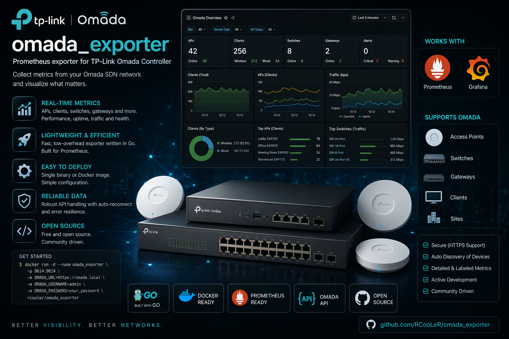

# OmadaBridge

OmadaBridge is an unofficial bridge for TP-Link Omada Controller data. It exposes Prometheus metrics, publishes the same collected data to Home Assistant through MQTT Discovery, and includes optional Lovelace cards for Home Assistant dashboards.

  

The published container and binary are still named `omada_exporter` / `omada-exporter` for compatibility with existing installs.

## Documentation

- [Bridge documentation index](./bridge/docs/index.md)
- [Installation](./bridge/docs/installation.md)
- [Collected data](./bridge/docs/collected-data.md)
- [Prometheus metrics](./bridge/docs/prometheus.md)
- [Home Assistant integration](./bridge/docs/home-assistant.md)
- [Home Assistant cards](./ha-cards/docs/index.md)

## Disclaimer

OmadaBridge is an unofficial DIY open-source project for compatibility, monitoring, and home automation integration. It is not affiliated with, endorsed by, or sponsored by TP-Link, Omada, Home Assistant, or Prometheus.

The bridge reads data from configured Omada APIs and publishes derived monitoring state. It is not a security product, not an availability guarantee, and not a substitute for Omada Controller backups, alerts, or vendor-supported management tools. Review what you publish to MQTT and Prometheus before exposing either service outside trusted networks.

See [NOTICE](./NOTICE) for trademark and affiliation notice.

## Repository Layout

- `bridge/` contains the Go exporter and Home Assistant MQTT bridge.
- `bridge/docs/` contains bridge installation, metrics, collected data, and Home Assistant integration docs.
- `ha-cards/` contains optional Lovelace cards.
- `ha-cards/docs/` contains card installation and configuration docs.

## License

MIT License. See [LICENSE](./LICENSE).
